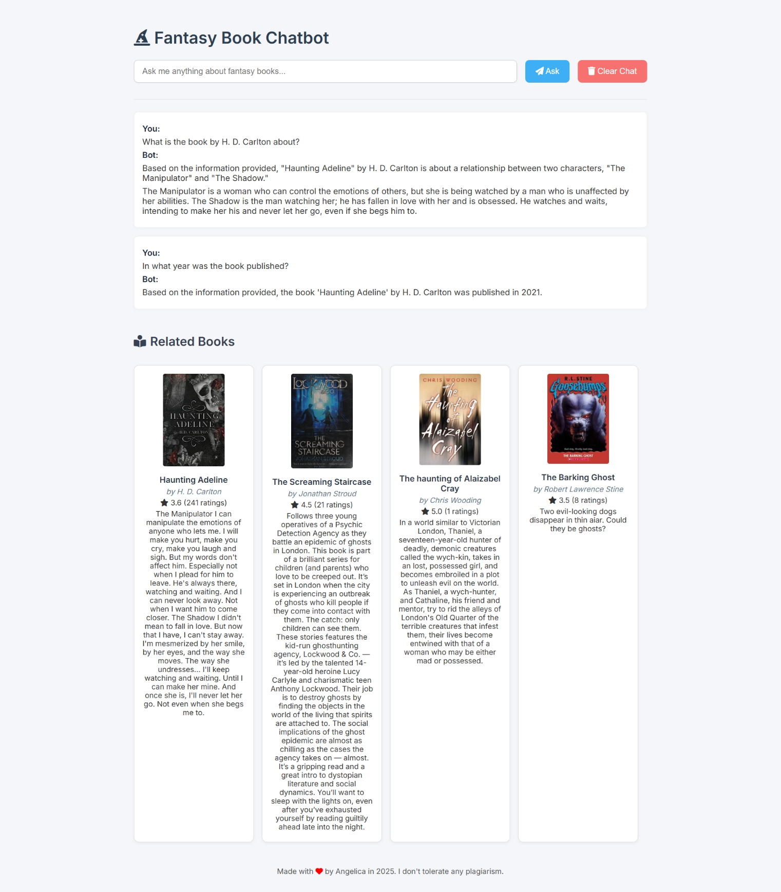

# 📚 Fantasy Book Chatbot — Retrieval-Augmented Generation (RAG)
A full-stack RAG (Retrieval-Augmented Generation) chatbot built with **FastAPI**, **LangChain**, **Gemini 2.5 Pro**, and **FAISS**, designed to answer questions about thousands of fantasy books. This project demonstrates the entire RAG pipeline—from data scraping to vector search, LLM integration, and deployment.


🌐 Live Demo: [fantasy-books-chatbot.up.railway.app](https://fantasy-books-chatbot.up.railway.app)  
📦 Repo: [github.com/hwasyui/rag-chatbot](https://github.com/hwasyui/rag-chatbot)

---

## 🔧 What I Built

### 1. 🕸️ Book Scraper
- Crawled **200 pages** from [OpenLibrary](https://openlibrary.org/) using **Selenium**
- Collected over **4,000 fantasy books** with metadata (title, author, rating, description, etc.)

### 2. 🔁 Data Pipeline
- Cleaned and structured the dataset using **Python**
- Stored data securely in **MongoDB Atlas**

### 3. 🔍 Vector Search
- Embedded descriptions using **HuggingFace's all-MiniLM-L6-v2**
- Indexed embeddings with **FAISS** for fast, semantic retrieval

### 4. 🤖 LLM Chatbot (RAG)
- Used **LangChain’s ConversationalRetrievalChain**
- Integrated with **Gemini 2.5 Pro** via API
- Users can ask natural language questions like:
  - “What fantasy books feature dragons?”
  - “Who wrote popular medieval fantasy series?”

### 5. 💬 Frontend UI
- Created with **FastAPI + Jinja2**
- Supports:
  - Markdown rendering for answers
  - Chat memory and contextual follow-ups

### 6. 🚀 Deployment
- Containerized with **Docker**
- Deployed seamlessly using **Railway**

---

## 🧠 Tech Stack

- **Backend**: FastAPI, LangChain, Gemini Pro API, FAISS
- **Frontend**: Jinja2 templates
- **Data**: Selenium, MongoDB Atlas
- **Embedding**: HuggingFace Transformers
- **DevOps**: Docker, Railway

---

## 📁 Project Structure
```
.
├── app/
│ ├── main.py # FastAPI app entrypoint
│ ├── chatbot.py # RAG pipeline (LangChain + Gemini)
│ ├── scraper/ # Selenium crawler for OpenLibrary
│ ├── db/ # MongoDB interaction & data prep
│ ├── vectorstore/ # FAISS index builder
│ └── templates/ # Jinja2 frontend templates
├── Dockerfile
├── requirements.txt
└── README.md
```

---

## 🚀 Getting Started

### 1. Clone the repository
```
git clone https://github.com/hwasyui/rag-chatbot.git
cd rag-chatbot
```
### 2. Install dependencies
```
pip install -r requirements.txt
```
### 3. Configure environment
```
Create a .env file and add your keys:
MONGODB_URI=your_mongodb_uri
GEMINI_API_KEY=your_gemini_api_key
```
### 4. Run the chatbot locally
```
uvicorn app.main:app --reload
Go to http://127.0.0.1:8000 in your browser.
```

### 🐳 Docker Support
To build and run the app using Docker:
```
docker build -t rag-chatbot .
docker run -p 8000:8000 rag-chatbot
```
### 💡 Use Cases
1. Book recommendation system
2. Intelligent library assistant
3. Educational tools for literature research

## 📌 Links
🔗 Live App: fantasy-books-chatbot.up.railway.app
🔗 GitHub: github.com/hwasyui/rag-chatbot

✨ Credits
Built with ❤️ by Angelica Suti Whiharto
Hashtags:
#python #llm #langchain #faiss #mongodb #gemini #fastapi #docker #railway #rag #webscraping #ai
